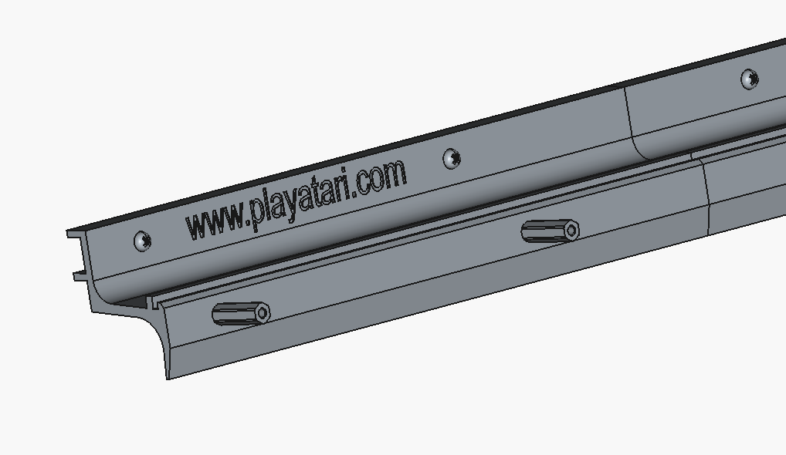
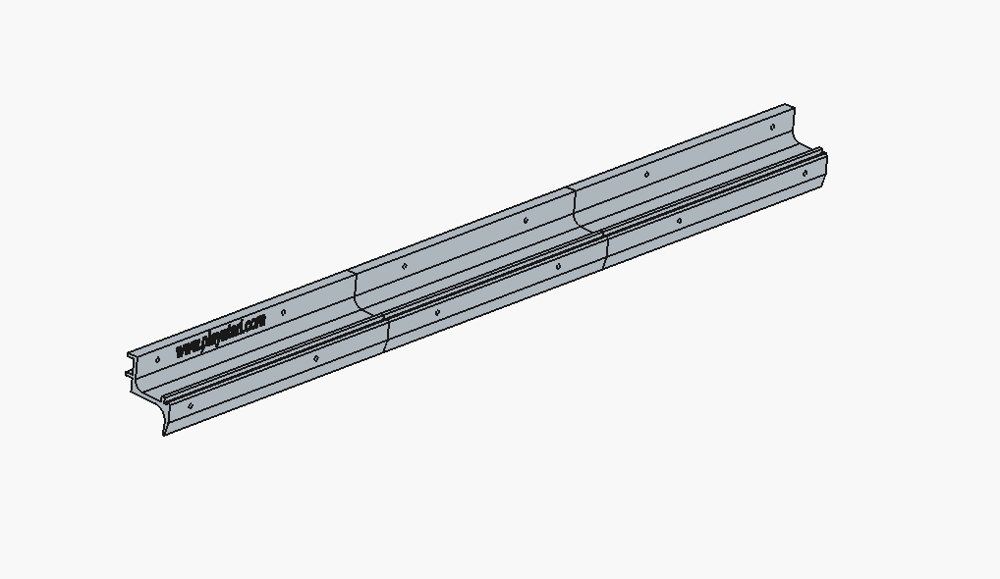

# OSC OSCar Middle Extrusion

Fellow OSCar owners,

Under previous ownership, my OSCar had taken a bit of a knock which has broken the centre extrusion. Unfortunately the part that had broken off was not in the case when I opened it.

The only solution I could see was to design a replacement part for 3D prinitng. The full FreeCad design files are included here.

The part that had boken was the part that secures the spacers that hold off the top of the case. I have copied that section from the mirror image of the rear extrusion. The result looks like this in side profile.

Obviously, I have carefully measured the bits that I have and done a bit of guesswork for the rest. The part as designed does fit my OSCar and performs adequately.

It would be useful if somebody could check my work and report back if I've guessed wrong.

The mounting holes for the spacers to the top and to the steel bar on the bottom look itentically spaced on the rear part so I have copied this for the middle. When measuring the hole spacing, they were not randomly (hand drilled) spaced. I suspect that there was a drilling jig used. I hope that this spacing also suits other machines.

The resulting parts looks like this ..

## Printing

The model is suppied as a whole and split into 3 parts. The split parts can be built on a Bamboo printer or similar. I have found that Black PLA has a similar tortional rigidity to the original.

Priniting is best orientated so each of the parts is grown on its end. Each part will be 8.24 inches tall. I had to put a structure externally to the part to hold it in place for printing. The first few attempts fell over.

My appologies (to European readers) for the imperial measurements. I only had an imperial vernier caliper handy!

Regards,

mike@playatari.com